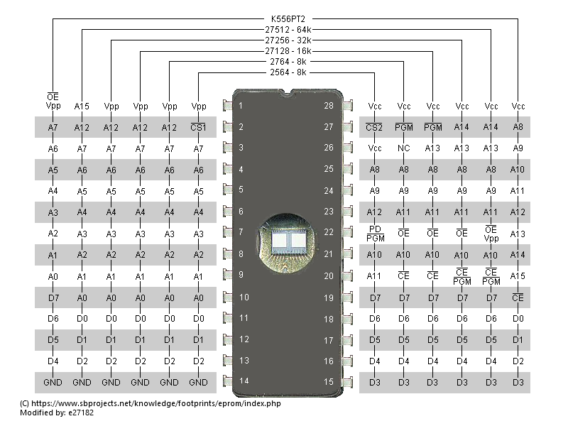

# Robik Firmware

This repo contains scripts and source files to work with firmware for ALP "Robik". Specifically used with Video firmware.

Robik is a personal computer developed at the Rotor Research and Development Institute (Cherkasy) by designer-engineer P. G. Khakalo in 1989.

## Available files

### conjunctive_table2EQN.py

```bash
python conjunctive_table2EQN.py rt012-01.txt rt012-01.eqn
```

Converts text representation of conjunctive table into equations in ABEL format.

### JED2EQN.py

```bash
python JED2EQN.py D27_Б1_556РТ2_012_01.jed >> D27_Б1_556РТ2_012_01.eqn
```

Converts JED fuse table into equations in ABEL format.

**Note**
Equation files are equal, that confirms correctness of the scripts.

### EQN2BIN.py

```bash
python EQN2BIN.py rt012-01.eqn Default.map.py Default.bin
```

`Default.bin` should match `Robik 27C256 РТ1.bin`.

```bash
python EQN2BIN.py rt012-01.eqn 27C512.map.py 27C512.bin
```

`27C512.bin` should match top 1/2 half of `RT2-012-01.BIN` (2nd half is the same).

Converts ABEL equations to binary firmware file. In general it generates truth table for ABEL equations, given Address and Data line mapping.

* Default.map.py - no mapping, produces original firmware.
* 27C512.map.py - mapping for 27C512 replacement by **Alex Zor**:
    * https://youtu.be/5viTYWENvOE
    * https://youtu.be/sdyl70sTDa4
    * https://youtu.be/pmTp5S6LdEc
    * https://youtu.be/XeTvhoQva-0
* It is also possible to produce firmware equal to 27C512 replacement proposed by **Fun Old Gamer**:
    * https://youtu.be/ONvSL_xYKAE
    * https://youtu.be/UMZVT8epNCs
    * https://youtu.be/BlnoSPmSj6g

Repo also contains modified EEPROM mapping (with К556РТ2 added), originally taken from:

https://www.sbprojects.net/knowledge/footprints/eprom/index.php
https://www.sbprojects.net/knowledge/footprints/eprom/eprom28.png

Updated version:



### Other files from other repos and places

* rt012-01.txt - <https://github.com/mvvproject/Library-Modules/blob/master/fdc_hdc/rt012-01.txt>
* D26_Ж8_556РТ2_012.jed
* D27_Б1_556РТ2_012_01.jed
* **Fun Old Gamer**
  * 27C512Робик РТ1.BIN
  * Robik 27C256 РТ1.bin
  * K556RT2_outputs.bin
* **Alex Zor**
  * RT2-012-01.BIN
  * RT2-012-01(27c256).BIN
* ROBIK.abl - my try to use ABEL, but due to Out of memory exception in DosBox-X was unable to use whole equation for Y1.